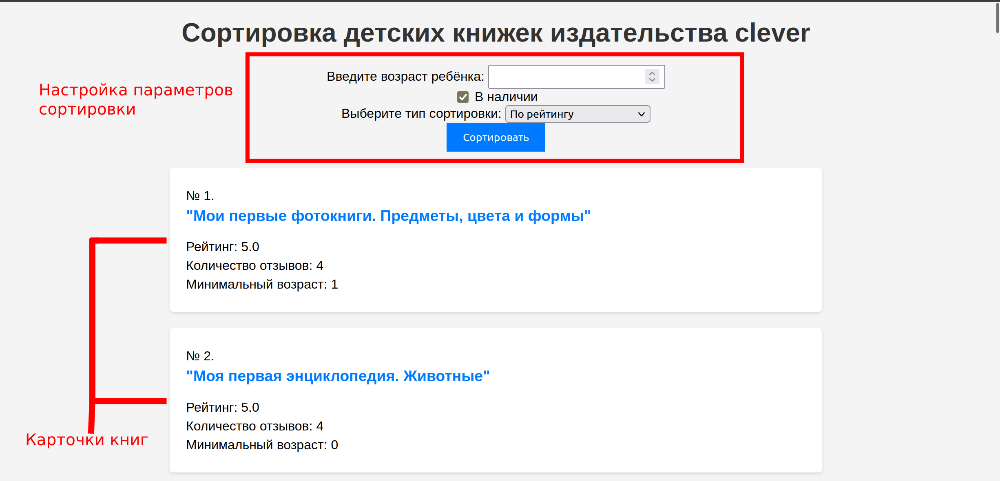

# Что делает проект:

Скрапит данные о книгах и отзывах с https://www.clever-media.ru/. Позволяет сортировать
книги по количеству отзывов и среднему рейтингу.

# Как использовать проект:

1. Склонировать репозиторий
2. Перейти в папку репозитория
3. Запустить build.sh
4. Дождаться запуска
5. Перейти на http://127.0.0.1:30006/
6. Отсортировать книги по предпочтительным параметрам
7. Переходить к просмотру понравившихся книг на официальный сайт

# Туториал по работе:

В верху страницы можно задать необходимые параметры сортировки и отсортировать
нажатием соответствующей кнопки.

Далее идёт список карточек отсортированных книг. Каждая карточка включается в себя
кликабельное название и информацию, по которой производится сортировка.
